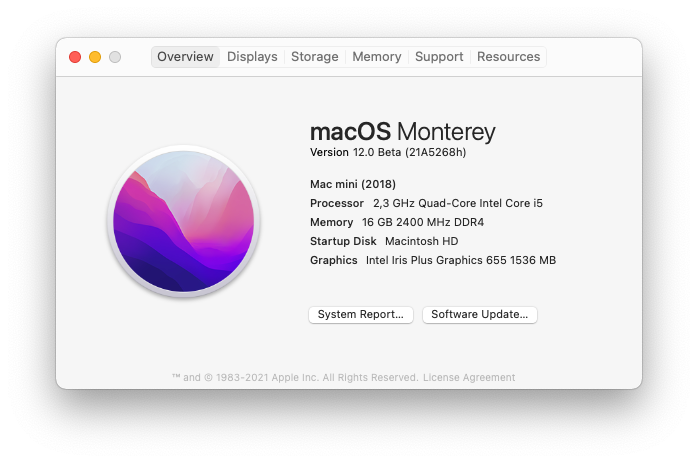

# Intel NUC8i5BEH (Comet Lake) - macOS 11

<!-- 

    

 -->

## OpenCore configuration for macOS Big Sur

**For educational purposes**. I don't take any responsibility for you voilating the Apple ToS and/or damaging your device.

## Installation

Add Serial, SystemUUID and MLB for SMBIOS `Macmini8,1`

## Base Specs

- CPU: i5-8259U
- GPU: HD655
- Audio Codec: ALC233
- Model: NUC8i5BEH
- Mobo: NUC8BEB
- Ethernet: Intel I219-V
- Wifi & Bluetooth: Intel AC 9560

## BIOS

- **Enable** - Legacy Boot
- **Disable** - Fast Boot
- **Disable** - VT-D
- **Disable** - Intel Software Guard Extensions (SGX)
- **Disable** - Intel Platform Trust
- **Disable** - Network Boot
- **Disable** - Wake on LAN

## Notes

Everything is working except Thunderbolt Hot-Plug.

Intel WiFi + Bluetooth is working stable for me. WiFi will be shown as Ethernet Interface. GUI switching requires custom client [HeliPort](https://github.com/OpenIntelWireless/HeliPort).

Bluetooth tested with Magic Keyboard 2, TB3 tested with LG 34UC99-W.
